<div align="center">

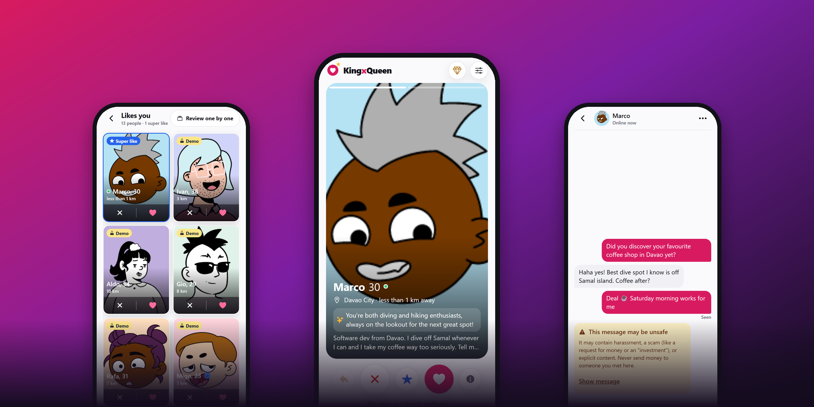

# KingxQueen

**Dating, done with intention.**

A full-stack dating app that mixes a Tinder-style swipe deck with Badoo-style People Nearby, with AI that helps people start conversations and keeps them safe while they do.<br>
One Expo codebase for **iOS, Android and the web**, on a TypeScript API backed by **Neon** (Postgres, Auth, Object Storage).


[**Interactive demo**](https://daddyk5.github.io/Project-Dating-Expo/demo/) · [Features](#features) · [Screenshots](#screenshots) · [Quick start](#quick-start) · [Architecture](#architecture) · [API](#api)

</div>

---

## Demo

<table>
<tr>
<td width="46%" align="center">
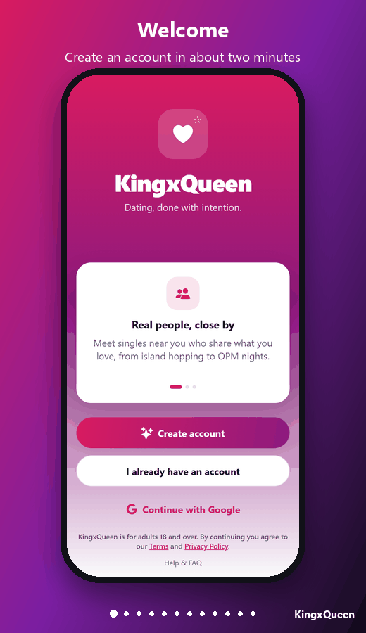
</td>
<td>

### Click through it yourself

The **[interactive demo](https://daddyk5.github.io/Project-Dating-Expo/demo/)** puts the real screens on a phone you can tap. Buttons go where they go in the app: create an account, swipe, match, pick an AI icebreaker, and watch a scam message get caught.

Suggested path:

1. **Welcome** → *Create account*
2. **Discover** → tap ♥ to match
3. **It's a Match** → *Send a message*
4. Pick an **AI icebreaker**, then send
5. **Matches** → *people like you* → like someone back

Use <kbd>←</kbd> <kbd>→</kbd> to step through, or press **Autoplay**.

> The demo is a static page in [`docs/demo/`](docs/demo/index.html). To run it locally, open that file in a browser.

</td>
</tr>
</table>

## Features

<table>
<tr>
<td width="33%" valign="top">

### 💘 Meet people
- **Swipe deck** with drag, buttons or <kbd>←</kbd> <kbd>→</kbd> <kbd>↑</kbd>, plus rewind
- **People Nearby** grid, closest first, with online-now dots and a shared interest on each tile
- **Likes you**: everyone who already liked you, as a grid or a swipe deck; like back to match instantly
- Two-way preferences for age, gender and distance, powered by PostGIS

</td>
<td width="33%" valign="top">

### 🤖 AI that helps
- **Compatibility line** on each card: what you actually share, in 90 characters or fewer
- **Icebreakers** written from both profiles
- **Bio polish**: two rewrites that keep your facts
- Runs on **Ollama** locally, **Anthropic** or the **Neon AI Gateway**, all server-side

</td>
<td width="33%" valign="top">

### 🛡️ Safe by default
- Every message is screened for **scams, harassment and explicit content**
- Flagged messages sit behind a warning; you decide whether to read them
- **Block, report and unblock**, with a Safety center
- 18+ enforced in the app, the API *and* a Postgres `CHECK`

</td>
</tr>
<tr>
<td valign="top">

### 💬 Real-time chat
- Socket.io delivery with **typing indicators** and **read receipts**
- Search and filter matches by unread or new
- Instant *It's a Match!* screen

</td>
<td valign="top">

### 🔐 Accounts
- Email sign-up with a strength meter, plus Google on the web
- **Forgot → reset password** by email, and **change password**
- Delete account removes the profile, photos and login

</td>
<td valign="top">

### ✨ Polish
- Light and dark themes, following the system or your choice
- Desktop web layout with a sidebar
- Profile-strength coaching, Help & FAQ, branded 404
- Accessible: labelled controls, 44 pt touch targets, AA contrast

</td>
</tr>
</table>

## Screenshots

<table>
<tr>
<td align="center">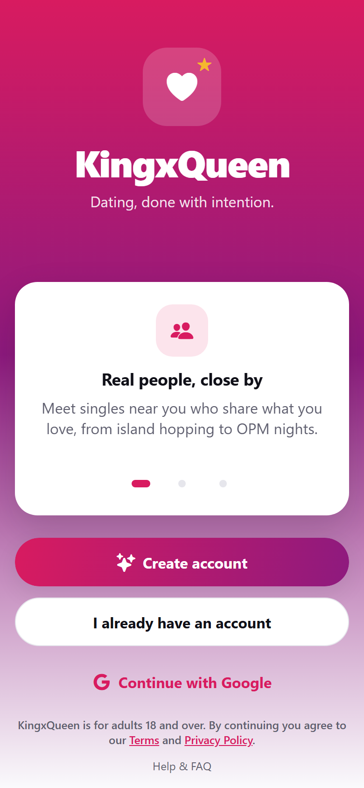<br><sub><b>Welcome</b></sub></td>
<td align="center">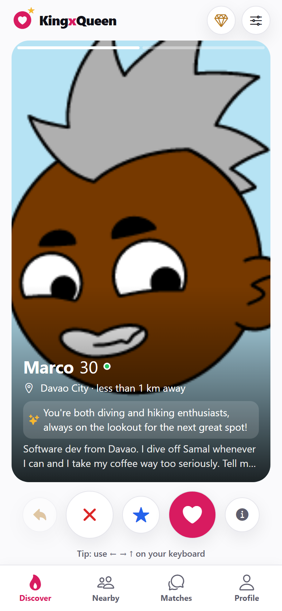<br><sub><b>Discover</b></sub></td>
<td align="center">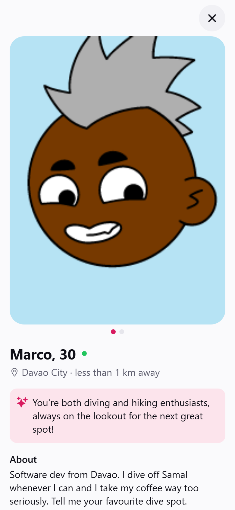<br><sub><b>Full profile</b></sub></td>
<td align="center">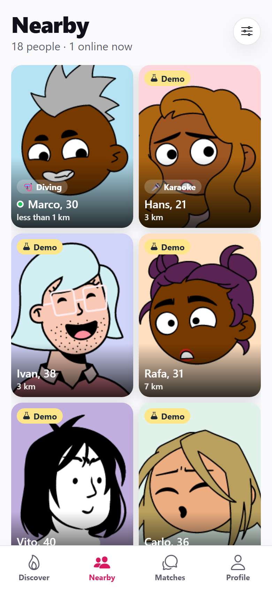<br><sub><b>Nearby</b></sub></td>
</tr>
<tr>
<td align="center">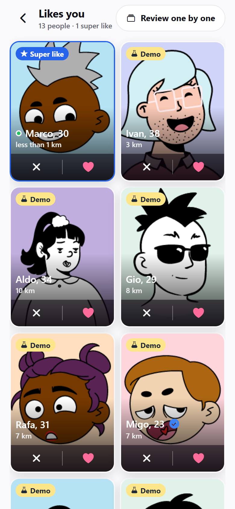<br><sub><b>Likes you</b></sub></td>
<td align="center">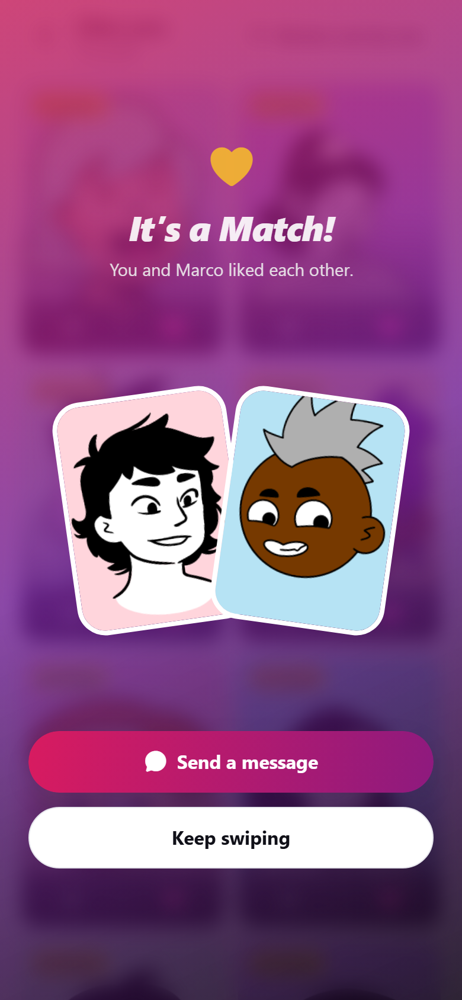<br><sub><b>It's a Match!</b></sub></td>
<td align="center">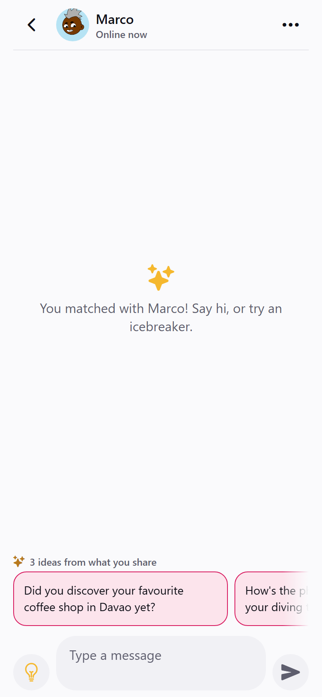<br><sub><b>AI icebreakers</b></sub></td>
<td align="center">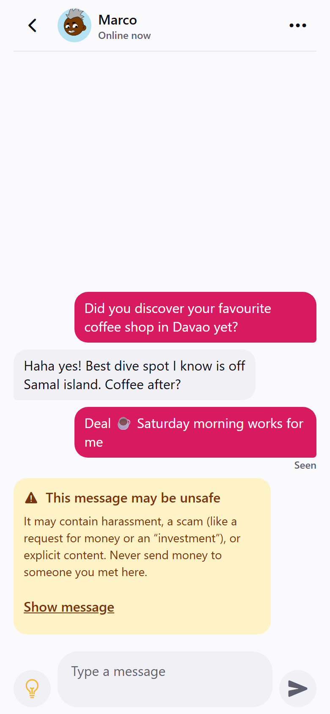<br><sub><b>Scam caught</b></sub></td>
</tr>
<tr>
<td align="center">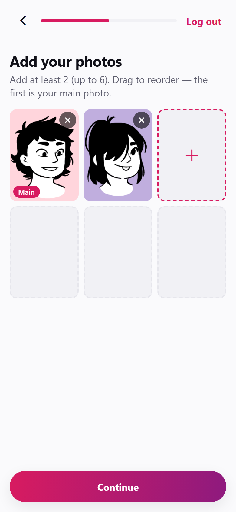<br><sub><b>Onboarding</b></sub></td>
<td align="center">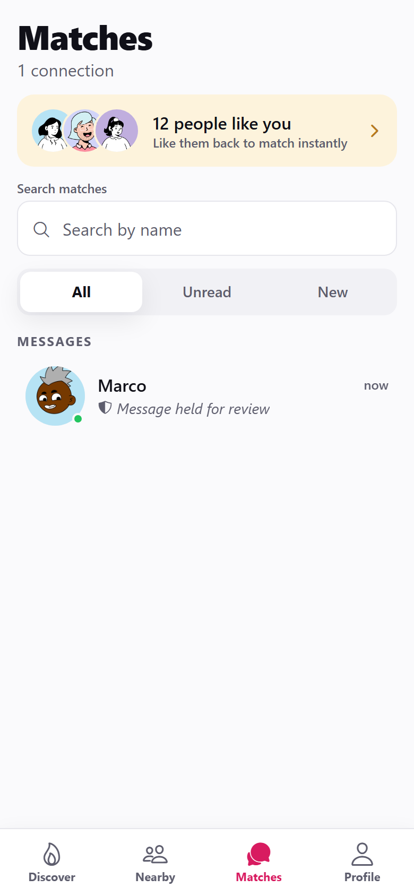<br><sub><b>Matches</b></sub></td>
<td align="center">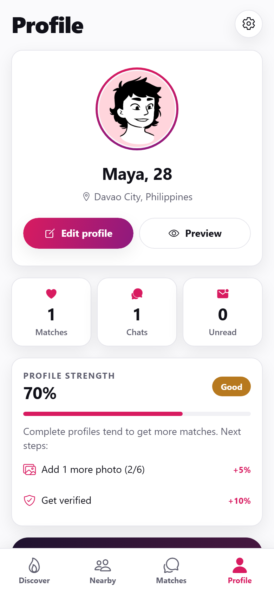<br><sub><b>Profile strength</b></sub></td>
<td align="center">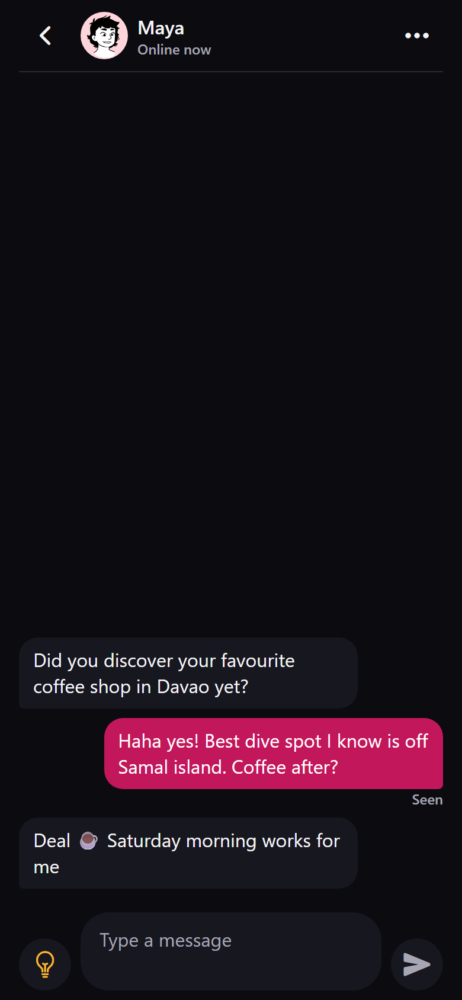<br><sub><b>Dark mode</b></sub></td>
</tr>
</table>

<details>
<summary><b>More screens</b>: review likes one by one, sign in, sign up, interests, settings, Royal, safety</summary>
<br>
<table>
<tr>
<td align="center">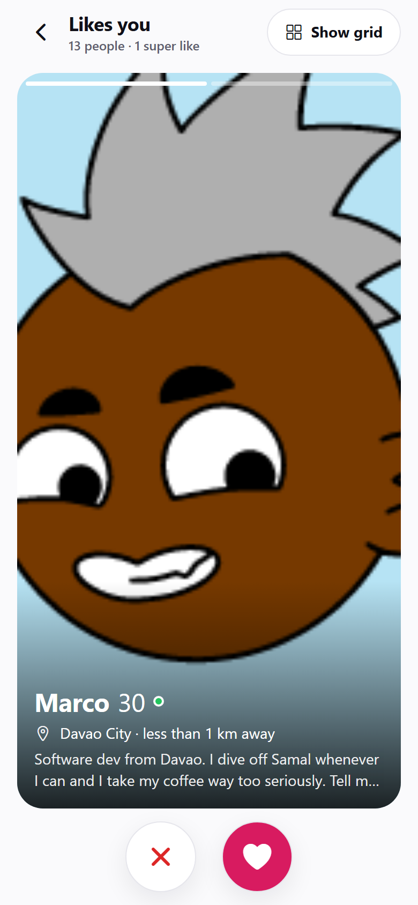<br><sub>Review likes one by one</sub></td>
<td align="center">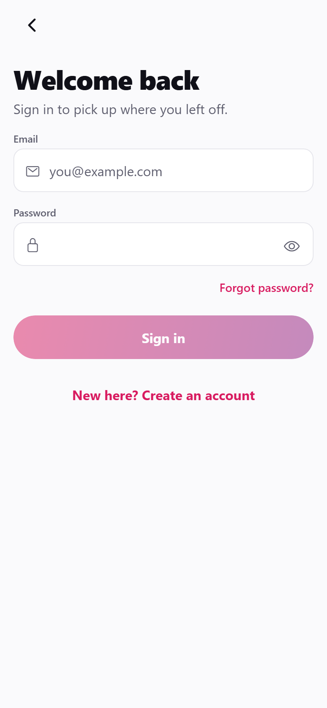<br><sub>Sign in</sub></td>
<td align="center">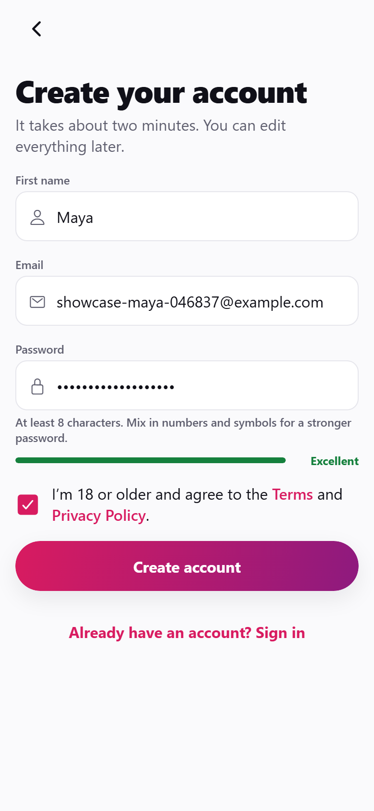<br><sub>Sign up</sub></td>
<td align="center">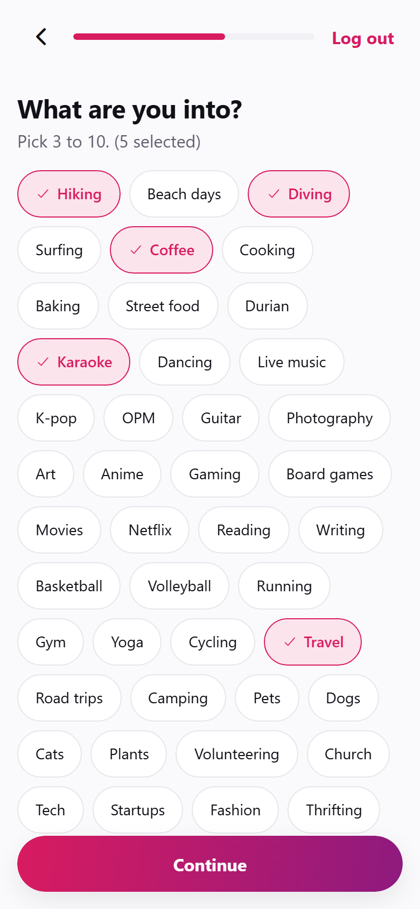<br><sub>Interests</sub></td>
</tr>
<tr>
<td align="center"><br><sub>Settings</sub></td>
<td align="center"><br><sub>Royal (waitlist)</sub></td>
<td align="center">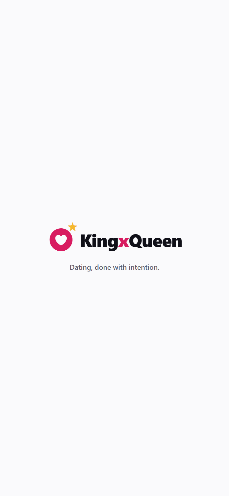<br><sub>Safety center</sub></td>
<td align="center">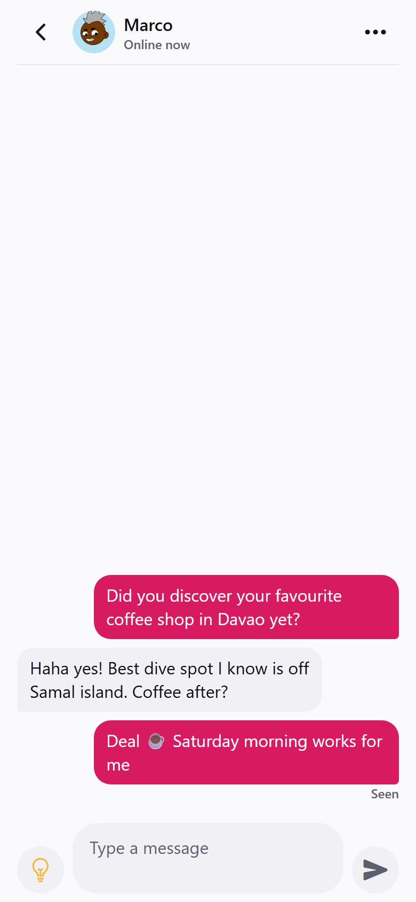<br><sub>Chat</sub></td>
</tr>
</table>
</details>

**On desktop**, the web app switches to a sidebar with your conversations:

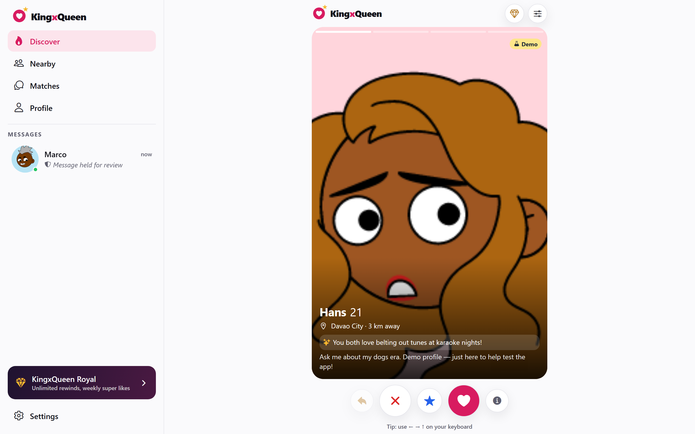

<sub>All profiles shown are fictional, with illustrated <a href="https://www.dicebear.com">DiceBear</a> avatars. Screenshots come from the real app, captured by <code>npm run screenshots</code>.</sub>

## Quick start

**Prerequisites:** Node 22, the Neon CLI (`npm i -g neon`), and [Ollama](https://ollama.com) with `ollama pull llama3.2:3b`.

```bash
npm install
neon auth                                # once, in a browser
neon checkout dev                        # pins the dev branch and writes DATABASE_URL, auth and storage vars into .env
cp apps/app/.env.example apps/app/.env   # then set EXPO_PUBLIC_NEON_AUTH_URL (neon neon-auth status)
npm run db:migrate                       # apply migrations to the checked-out branch
npm run seed                             # 40 fictional demo profiles (refused when NODE_ENV=production)

npm run dev:api                          # API  → http://localhost:4870
npm run web                              # app  → http://localhost:8081
```

> [!IMPORTANT]
> Start Expo with the root scripts (`npm run web`, `npm start`, `npm run ios`, `npm run android`) or from inside `apps/app`.
> Running `npx expo start` in the repo root fails with **`Unable to resolve module ../../App`**.

`.env` holds secrets and is gitignored; `.env.example` lists every variable.

## Architecture

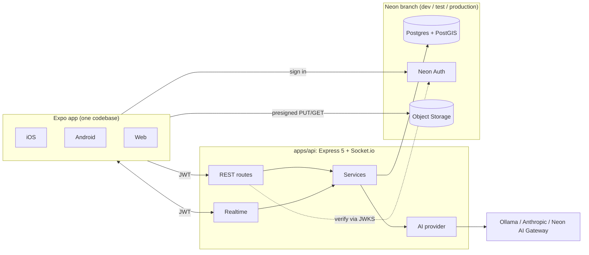

```
apps/api         Express 5 + Socket.io API (TypeScript, Drizzle ORM)
apps/app         Expo Router app (SDK 57): iOS, Android, web
packages/shared  zod schemas, constants and types used by both
e2e/             Playwright end-to-end tests and the screenshot capture
docs/            README images and the interactive demo
neon.ts          Neon services: Auth, private "uploads" bucket, "api" function
```

| Concern | What's used |
| --- | --- |
| Database | Neon Postgres + PostGIS, Drizzle ORM (`apps/api/src/db/schema.ts`, migrations in `apps/api/drizzle/`) |
| Auth | Neon Auth (Managed Better Auth). The app signs in against the branch's Auth URL; the API verifies the 15-minute EdDSA JWT against the branch JWKS |
| Photos | Private Neon Object Storage bucket. Presigned PUT for uploads, presigned GET for reads |
| Realtime | Socket.io, authenticated with the same JWT |
| AI | Provider interface in `apps/api/src/ai/`: **Ollama** (default), Anthropic or the Neon AI Gateway |
| App | Expo Router, Reanimated + Gesture Handler (swipe deck), TanStack Query |

### Neon branches

| Branch | Used for |
| --- | --- |
| `production` | Production. Never seeded. |
| `dev` | Local development (`.neon` points here). Has the demo profiles. |
| `test` | Vitest. Migrated automatically before each run; tests clean up after themselves. |

Each branch has its own database, Auth users and bucket contents.

## API

Every route except `/health` needs a Neon Auth JWT (`Authorization: Bearer …`).

| Area | Endpoints |
| --- | --- |
| Me | `GET/PUT/DELETE /me` · `PUT /me/location` · `PUT /me/preferences` · `POST /me/complete-onboarding` |
| Photos | `POST /photos/upload-url` · `POST /photos` · `PUT /photos/order` · `DELETE /photos/:id` |
| Discovery | `GET /discover` · `GET /nearby` · `GET /profiles/:id` · `GET /likes` |
| Swipes | `POST /swipes` (like, pass, superlike) · `POST /swipes/undo` |
| Matches & chat | `GET /matches` · `DELETE /matches/:id` · `GET/POST /matches/:id/messages` · `POST /matches/:id/read` |
| Safety | `POST /blocks` · `GET /blocks` · `DELETE /blocks/:id` · `POST /reports` |
| AI | `POST /ai/icebreakers` · `POST /ai/bio-polish` · `POST /ai/compatibility` |

### AI features

All model calls happen on the server, so keys never reach the app. Prompts live in `apps/api/src/ai/prompts.ts`, and every response is validated with zod (one retry on invalid output).

- **Icebreakers:** 3 openers based on shared interests and both bios
- **Bio polish:** 2 rewrites that keep the user's facts
- **Compatibility:** one line on what two profiles share, cached 7 days per pair
- **Message safety:** fast rules first (money, crypto and investment scams), then the model (harassment, explicit content, subtler scams). If the model is down, chat keeps working on the rules alone.

User-triggered AI calls are limited to 20 per user per hour (`AI_REQUESTS_PER_HOUR`). Switch providers in `.env`:

```bash
AI_PROVIDER=ollama        AI_MODEL=llama3.2:3b                  # default, local
AI_PROVIDER=anthropic     AI_MODEL=claude-haiku-4-5-20251001    # plus ANTHROPIC_API_KEY
AI_PROVIDER=neon-gateway  AI_MODEL=<model>                      # paid Neon plans; set NEON_AI_GATEWAY_URL/TOKEN
```

### Safety rules enforced by the API

- Every route except `/health` requires a valid JWT, and so does the Socket.io handshake.
- Users must be 18 or older. This is checked in the app, in the API (zod) and by a Postgres `CHECK` constraint.
- Only members of an active match can message each other. Blocking or unmatching ends the chat.
- Demo profiles (`is_demo`) are fictional, use illustrated avatars, show a "Demo" badge, can't receive messages, and are hidden in production.

## Testing

| Command | What it covers |
| --- | --- |
| `npm test` | 62 API tests (vitest + supertest) against the Neon `test` branch: auth, discovery, matching races, messaging, likes, blocks |
| `npm run e2e` | Web end to end: two users sign up → onboard → find each other → match → chat → safety warning → delete accounts |
| `npm run e2e:features` | Likes you, Blocked people, change password, reset-password link states, 404 |
| `npm run screenshots` | Regenerates everything in `docs/screenshots/` from the running app |
| `npm run lint` · `npm run typecheck` | ESLint and TypeScript for every workspace |

The e2e scripts need the API, Expo web on `:8081` and Ollama running, plus `npx playwright install chromium` once. They delete the accounts they create.

## Scripts

| Command | What it does |
| --- | --- |
| `npm run dev:api` | API with hot reload |
| `npm run web` · `npm start` · `npm run ios` · `npm run android` | Expo app |
| `npm run db:generate` | Generate a migration after editing the Drizzle schema |
| `npm run db:migrate` | Apply migrations to the branch in `DATABASE_URL` |
| `npm run seed` · `npm run seed:reset` | Replace or remove the demo profiles |

## Roadmap and known limitations

- [ ] **Push notifications.** The settings exist; delivery arrives with the store builds.
- [ ] **Photo moderation tool.** Production photos start as `pending`; development auto-approves.
- [ ] **Self-serve verification.** Badges are granted by the team for now.
- [ ] **KingxQueen Royal.** The membership page and waitlist exist; payments don't.
- [ ] **Native builds** typecheck and bundle, but only the web app is tested end to end.
- **Auth client:** `@neondatabase/auth@0.5.0-beta` can't be installed in this npm workspace (npm's resolver crashes on its peer tree), so `apps/app/src/lib/auth.tsx` calls the same Better Auth endpoints directly.
- **Google sign-in** is web-only and uses Neon's shared development credentials; production needs its own OAuth app.
- **Metro on Windows** sometimes misses file changes in this monorepo. Restart with `npx expo start -c`.
- **Latency:** the Neon project is in `aws-us-east-2`. From the Philippines each query round trip is about 300 ms; `aws-ap-southeast-1` (Singapore) would feel noticeably snappier.

## License

No license has been chosen yet, so all rights are reserved by the author. Open an issue if you'd like to use the code.
